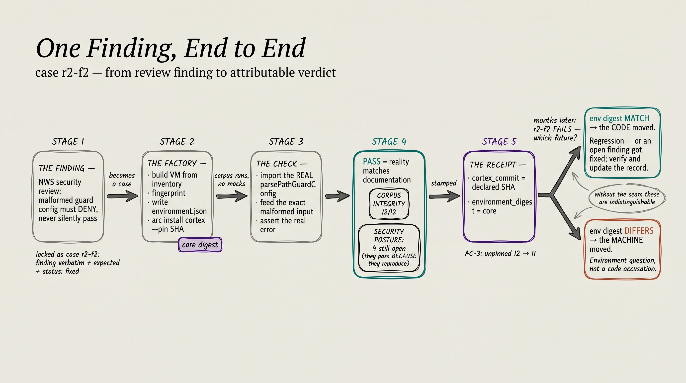

# A worked example: one finding, end to end

How a security finding becomes a case, how a case runs on a factory VM,
and what the environment seam buys when things later disagree. The example
is real: case `r2-f2` of the execution-boundary corpus.



## Where the corpus came from

The corpus is twelve findings from Robert Chuvala's (NWS) security review
of cortex's execution boundary — the hook layer that decides what an agent
may actually do. Rounds 1 and 2 were locked in **with no environment
recorded at all**, and Rob caught it:

> "what substrate were those captured on? If we didn't record it, we have
> cases locked against an unpinned baseline."

Every piece of environment machinery in this repo is the answer to that
question. The twelve cases were backfilled to honest `null` — recorded as
unknowable rather than guessed — and the runner prints the unpinned count
loudest of anything it says.

## The case

`r2-f2`: *a malformed `CORTEX_PATH_GUARD` field must be treated as a
genuine failure and DENY — never silently coerced into an empty,
permissive policy.* Status: `fixed`. The case file carries the finding
verbatim, its provenance, the expected behaviour stated so it can be
refuted, and a check module.

## The run

The factory side (see crucible's
[stack-and-seams](https://github.com/the-metafactory/crucible/blob/main/docs/stack-and-seams.md))
builds a VM whose inventory declares everything, including the target pin,
fingerprints it, writes `/etc/assay/environment.json`, and installs cortex
at the exact declared SHA. Then:

```
ASSAY_CORTEX_REPO_PATH=… bun run eval:execution-boundary
```

Checks execute against cortex's **real code** — three mechanisms, no
mocks: `unit-import` (import the actual exported function, feed it the
finding's exact input, assert the real behaviour), `spawn-hook` (spawn the
real hook script with a session's stdin/env/cwd, read its actual
decision), `doc-grep` (a durable cited marker).

```
[PASS] r2-f2  (round 2, documented status: fixed)
       parsePathGuardConfig treats the malformed field as a genuine failure:
       "CORTEX_PATH_GUARD.allowedDirs must be an array of strings (got string)"
[PASS] r2-f5  (round 2, documented status: open)
       …the round-2 F5 finding still reproduces (status: open).
```

**PASS means reality matches documentation — not "the code is good."**
Open findings pass *because the vulnerability still reproduces*. That is
why the rollup is two lines, not one: `CORPUS INTEGRITY` (does reality
match the record) and `SECURITY POSTURE` (how many findings remain open).
A FAIL is always news: on a `fixed` case it is a regression; on an `open`
case it may be good news — the hole closed and the record needs updating.

## The stamp

The run records both identities on every case's baseline:

```
environment: linux/amd64  kernel …  bun …  cortex@<declared SHA>  env@<core digest>
```

`cortex_commit` equal to the inventory's pin, `environment_digest`
non-null: that is crucible's **AC-3** — the factory's pin reaching the
assay result — and the unpinned count starts falling from 12.

## What the seam buys: two futures, distinguished

**Cortex changes and `r2-f2` fails.** The stamp says `environment_digest:
match` — same machine identity, so the *code* moved. A regression, or (on
an open case) a fix to verify and record.

**Someone reruns on a drifted machine and `r2-f2` fails.** The stamp says
`environment_digest: <old> → <new>` — the *machine* moved, and the failure
is an environment question before it is a code accusation.

Without the seam those futures are indistinguishable, and "did cortex
break?" is answered with a shrug. With it, disagreement between two runs
is **attributable instead of mysterious** — which is the entire instrument.

---

For the meta level — how this seam fits metafactory's
factory-of-factories claim, and why the receipt above is the point
where the three factories close into one production line — see
[vision/factory-of-factories](https://github.com/the-metafactory/vision/blob/main/factory-of-factories.md).
